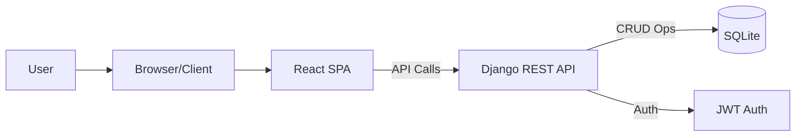

# System Patterns: Modern To-Do Application

## System Architecture
The application follows a standard client-server architecture:
-   **Frontend (Client):** A Single Page Application (SPA) built with React. It handles the user interface, user interactions, and communication with the backend API.
-   **Backend (Server):** A RESTful API built with Python/Django using the Django REST Framework (DRF). It manages business logic, data persistence (using PostgreSQL), and user authentication.

## Key Technical Decisions & Patterns
-   **Frontend Framework:** React with Vite for a fast development experience and optimized builds.
-   **Styling:** TailwindCSS for utility-first CSS, enabling rapid UI development and consistency.
-   **State Management:** Redux Toolkit for managing global application state, particularly for tasks and user authentication status. This provides a predictable state container.
-   **Routing:** React Router for handling client-side navigation between different views (e.g., Login, Dashboard, Settings).
-   **API Communication:** Axios for making HTTP requests from the React frontend to the Django backend API.
-   **Animations:** Framer Motion for implementing smooth UI animations and transitions, enhancing the user experience.
-   **Backend Framework:** Django with Django REST Framework (DRF) for building a robust and scalable REST API quickly.
-   **Database:** SQLite, a lightweight file-based database suitable for development and simpler applications. Will be used for this project instead of PostgreSQL.
-   **Authentication:** JSON Web Tokens (JWT) for stateless authentication between the frontend and backend. The backend will issue tokens upon successful login, and the frontend will include the token in subsequent API requests.
-   **API Design:** RESTful principles will guide the API design, using standard HTTP methods (GET, POST, PUT, DELETE) for resource manipulation (tasks, users).
-   **CORS:** Configure Cross-Origin Resource Sharing (CORS) on the Django backend to allow requests from the React frontend domain.

## Component Relationships (Initial Thoughts - Frontend)
-   `App.js`: Main application component, sets up routing.
-   `Routes`: Defines application routes (Login, Register, Dashboard, Settings).
-   `Auth Pages` (Login, Register): Handle user authentication forms and logic.
-   `Dashboard Page`: Main view after login. Contains:
    -   `TaskList`: Displays the list of tasks.
        -   `TaskItem`: Represents a single task in the list.
    -   `TaskFilter`: Component for filtering tasks (All, Active, Completed).
    -   `AddTaskButton`: Button to open the task creation modal.
-   `TaskModal`: Modal form for adding or editing tasks.
-   `Settings Page`: Contains user profile settings and theme toggle.
-   `Store` (Redux): Centralized state management for tasks, user info, UI state (e.g., dark mode).

## Critical Implementation Paths
1.  **Authentication Flow:** Secure registration, login, JWT generation/validation, and storing the token on the client. Protecting API endpoints.
2.  **Task CRUD Operations:** Implementing the API endpoints and corresponding frontend logic for creating, reading, updating, and deleting tasks, ensuring state updates correctly in Redux.
3.  **State Synchronization:** Keeping the frontend UI consistent with the backend data, especially after task operations or when filtering/sorting.
4.  **Responsive Design:** Ensuring the layout adapts correctly across different screen sizes using TailwindCSS.
